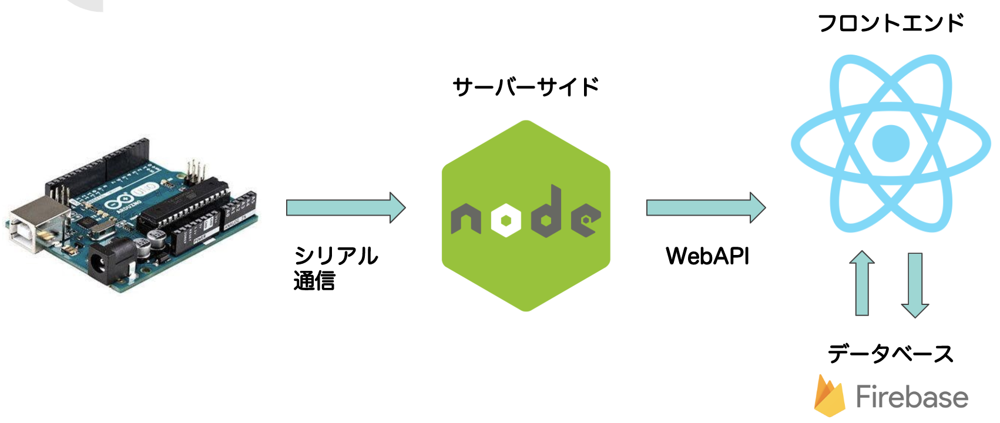
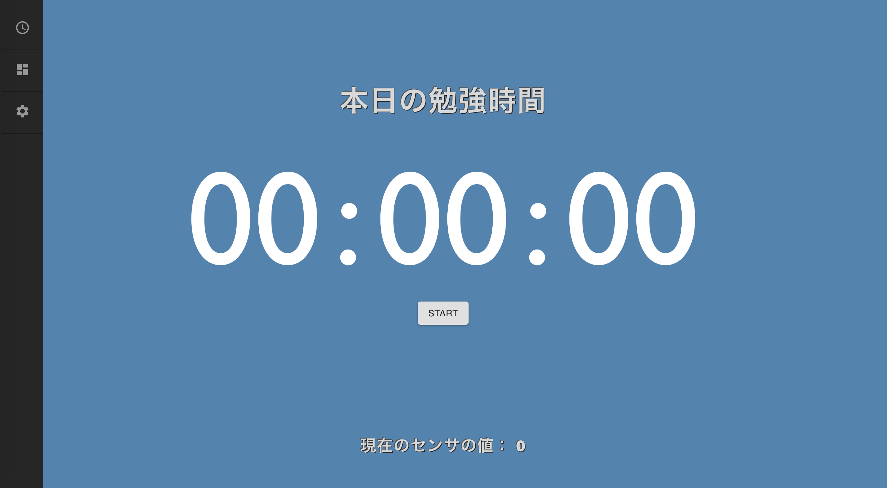
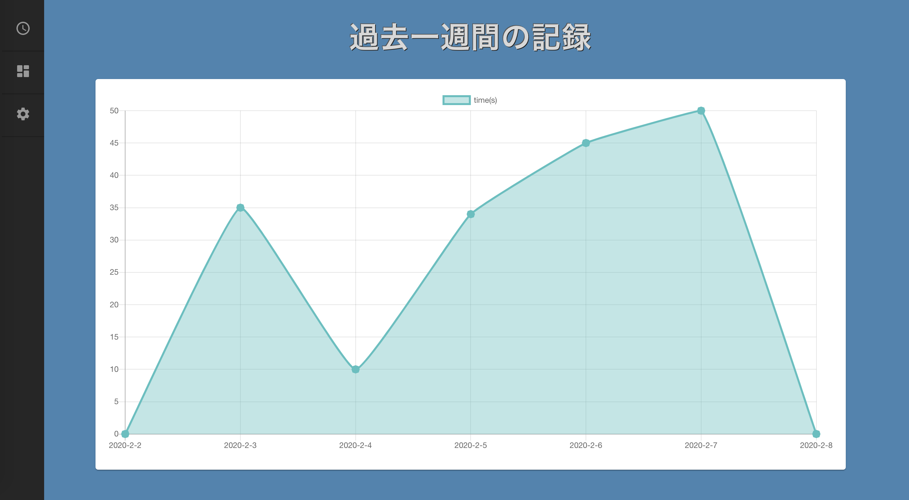
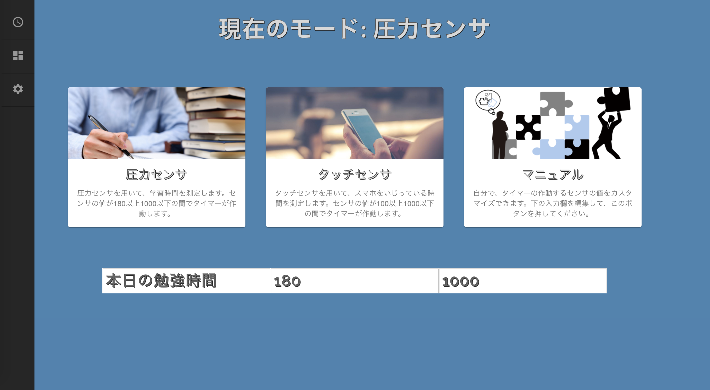

# DEMO

# OVERVIEW

The study time is measured by wrapping a pressure sensor around the sharpen. When the value of the sensor exceeds a certain value, a timer is activated. You also can check past logs in a graph.

# TECHNOLOGY

- Hardware ( Aruduino, touch sensor, pressure sensor )

- Server side ( Node.js, Express, SerialPort )

- Front end ( React.js, TypeScript, axios, node-sass, Chart.js )

- Database ( Firestore )

# PAGES

### record page

### graph page

### mode select page

